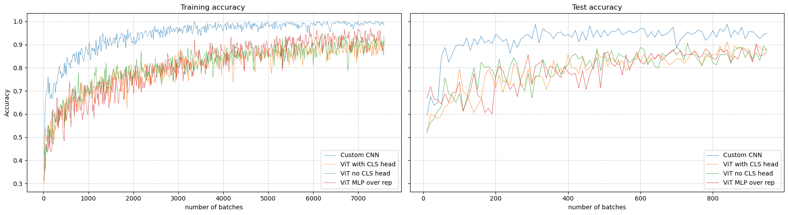

# 🧠 Brain Cancer Classifier Project

This repository contains our final project for the Deep Learning course, focused on the **automated classification of brain cancer** using MRI scans. The goal was to apply and reinforce theoretical concepts through a real-world medical imaging challenge.

## 🧪 Project Overview

We explored and compared two state-of-the-art deep learning architectures:

- A **Convolutional Neural Network (CNN)**
- A **Vision Transformer (ViT)** with 3 different derivations (conventional - different FCs for each head - MLP over Reps)

These models were trained to classify MRI scans into three categories: **glioma**, **meningioma**, and **brain tumor**, using the **Bangladesh Brain Cancer MRI Dataset** consisting of **6,056 scans**.

Our pipeline included:

- Data preprocessing and augmentation
- Exploration of ViT derivatives
- Advanced evaluation metrics and visualization

This study demonstrates the potential of deep learning to support **rapid and reliable brain tumor diagnosis** in clinical settings.

## 📊 Training & Evaluation

Here is our training and testing accuracy plot:

<div align="center">
  
</div>

## 📄 Final Report

For detailed methodology, results, and discussion, check out our final report:

👉 [Brain_Cancer_Detection_Report.pdf](Brain_Cancer_Detection_Report.pdf)

## 🛠️ Tech Stack


```
├── README.md
├── data
│   ├── external       <- Data from third party sources.
│   ├── interim        <- Intermediate data that has been transformed.
│   ├── processed      <- The final, canonical data sets for modeling.
│   └── raw            <- The original, immutable data dump.
│
├── notebooks          <- Jupyter notebooks. Naming convention is a number (for ordering),
│                         the creator's initials, and a short `-` delimited description, e.g.
│                         `1.0-jqp-initial-data-exploration`.
│
├── main.ipynb         <- Main notebook with some data exploratory, train & tuning models and plots
|
├── results_cnn.json
├── results_ViT_diff_head_cls_model.json
├── results_ViT_diff_head_mlp_over_rep.json
├── results_Vit_diff_head_no_cls_model.json
├── results_ViT_ref_book.json
|
└── cancer_classifier   <- Source code for use in this project.
    │
    ├── __init__.py             <- Makes cancer_classifier a Python module
    ├── config.py               <- Store useful variables and configuration
    |
    ├── modeling                <- Contrains models, training and tuning code
    |   |
    |   ├── models              <- Contains models
    |   |   ├── cnnmodel.py
    |   |   ├── vit_diff_head_cls
    |   |   ├── vit_diff_head_mlp_over_rep.py
    |   |   ├── vit_diff_head_no_cls
    |   |   └──vit_ref_book.py
    |   |
    │   └── train.py            <- Code to train models and tune models
    |
    └── processing              <- Contrains data loader, data processing and plot code
        │
        ├── data_loader.py      <- The main data loader
        ├── dataset_loader.py   <- Not relevent anymore, it is still called in some old notebooks
        ├── image_utils.py      <- Utility functions for image processing
        └── plots.py            <- Code to create visualizations
```


## 📚 Citation

If you use this work, please cite the Bangladesh Brain Cancer MRI Dataset [1].

---

Feel free to add sections like installation, usage, or contributors if needed. Want help writing those too? I'm here for it.
## Project Organization

Here is the structure of the project. The main file to look at is main.ipynb. It was more convenient to use a notebook for running the code on the cluster.
